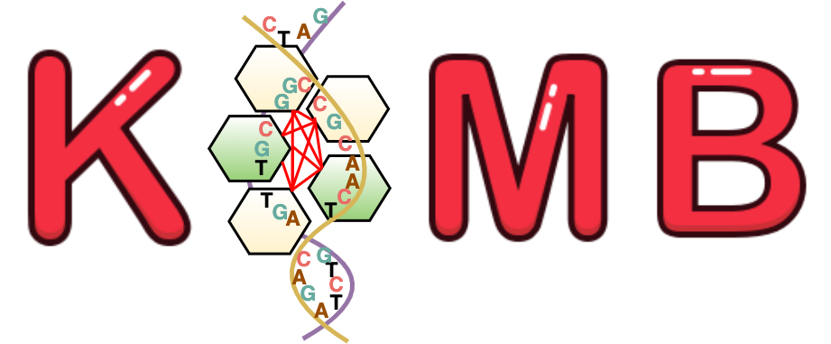

# KOMB - K(c)ore genome analyzer
KOMB uses K-Core decomposition of unitig graphs  to analyze core genomes and repeats in single and metagenomes

**Dependencies:** 2. In order to run KOMB, you will need [Python 3.x](https://www.python.org/download/releases/3.0/), [Kraken](https://github.com/DerrickWood/kraken),  [ABySS](https://github.com/bcgsc/abyss)
and [Lighter](https://github.com/mourisl/Lighter), [C++ -11](http://www.cplusplus.com/).

You also need _igraph-c_, a popular C library for large scale network analysis as described [here](https://igraph.org/c/).

KOMB has two major dependencies for Core genome analysis:
```
1. Igraph C Library
2. Boost C++ Library
```
**Read filtering**
We use _kmer_filter_ to filter out the reads. The default filtering setting we use is given by the following string
```
kmer_filter -1 READ1 -2 READ2 -o output_filtered -D --abundant --k-len 15 --max_k_freq 2
```
This will filter out all reads containing more than 80% of abundant kmers. The kmer size is 15 and abundance threshold is 2 occurences. 
``--abundant`` flag means that those reads that have abundant kmers will be discarded and ``-D`` flag allows us to capture the discarded reads.
We then use the files ``output_filtered/READ*discards.fq`` for the rest of the process.

**Usage:**
``
python3 run.py [Flags]
``
The description of various flags is given below. Please note that while running with **-m** it is necessary to specifiy both **-k** and **-db** i.e path to kraken and the database to use for taxonomonic classification
```
usage: run.py [-h] [-m] [-s] [-1 READ1] [-2 READ2] [-c] [-g GENOMESIZE]
              [-l LEVEL] [-k KRAKEN] [-db DATABASE] [-n NUMHITS] [-e KMER]
              [-f] [-u]

KOMB: K-core decomposition on unitig graph

optional arguments:
  -h, --help            show this help message and exit
  -m, --metagenome      Reads are metagenomes
  -s, --single          Reads are single/closely related genomes
  -1 READ1, --read1 READ1
                        P.E Read1.fa/P.E Read1.fq
  -2 READ2, --read2 READ2
                        P.E Read2.fa/P.E Read2.fq
  -c, --correction      Read correction required
  -g GENOMESIZE, --genomesize GENOMESIZE
                        Input genome size
  -l LEVEL, --level LEVEL
                        Classification level for kraken (genus or species)
  -k KRAKEN, --kraken KRAKEN
                        path to kraken
  -db DATABASE, --database DATABASE
                        path to kraken database
  -n NUMHITS, --numhits NUMHITS
                        Bowtie2 maximum hits per read
  -e KMER, --kmer KMER  Set kmer size (less than equal to 100)
  -f, --gfa             Build from SPAdes GFA graph
  -u, --unitig-filter   Filter out unitigs below read length

```
You can use the C++ igraph script as a standalone binary as well if required by tweaking some functions. Please run
```g++ -O3 komb.cpp -Iinclude/igraph/ -Llib/ -ligraph -I/include/boost/ -fopenmp -o komb``` if you do change the kode or ```./compile.sh``` and rerun KOMB
